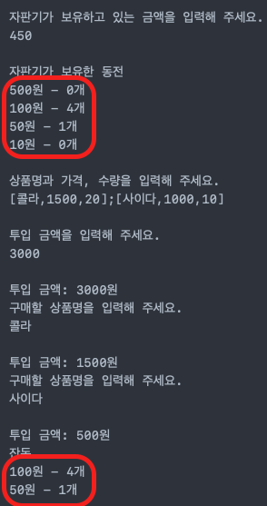

# 0.  다시 되돌아보며

3주간의 프리코스 과정을 마치고 코딩테스트를 앞두고 있습니다.  
매 주마다 아쉬움이 남고, 그 다음 미션에 아쉬웠던 부분을 적용하면서 코드를 작성하다보니  
조금씩 스스로 발전해나간다는 느낌이 강렬하게 들었었는데요.

코딩테스트를 치루기 전 마지막 한 단계만 더 레벨업해보자는 생각으로 제출했던 코드를 조금 수정해보고자 합니다.

# 1. 아쉬웠던 부분들 ?

## A. 잘못된 Repository의 역할
: `Controller`, `Service`, `Repostiry` 로 이루어지는 `Layered Architecture`는  저마다 각각의 역할이 있습니다.  
`Controller`는 여러가지 Service를 조합해서 사용하고,  
`Service`는 실질적인 비즈니스 로직을 수행하고,  
`Repository`는 데이터의 품질을 보장하는 역할을 합니다.

1, 2주차 때는 `Layered Architecture`를 사용하지 않았는데, 그 이유는 다음과 같습니다

1. `Layered Architecture`를 거의 이해하지 못했다.
2. "데이터의 품질 보장"의 중요성을 잘 몰랐다.
3. 관리해야할 데이터가 1개, 혹은 2개였다.

하지만 "데이터를 잘 관리하자"는 목적으로 사용한 클래스는 존재했습니다.  
[1주차 숫자 야구 게임](https://github.com/cjlee38/java-baseball-precourse/blob/cjlee38/src/main/java/baseball/domain/ball/NumberBallSet.java)  
[2주차 자동차 경주 게임](https://github.com/cjlee38/java-racingcar-precourse/blob/cjlee38/src/main/java/racingcar/domain/car/CarSet.java)

두 클래스가 쓸모없는 역할을 하지는 않습니다. 여러 개의 데이터가 가져야할 특성도 존재하니까요(가령, 중복 여부를 판단한다던지..)

----

한편, 제가 작성했던 Repository는 다음과 같습니다.

```java
public class DepositRepository {

	private static Money depositMoney;

	public DepositRepository() {
		depositMoney = Money.ZERO;
	}

	public DepositRepository(Money money) {
		depositMoney = money;
	}

	public Money save(Money money) {
		depositMoney = money;
		return get();
	}

	public Money get() {
		return depositMoney;
	}

	public void decrease(Price price) {
		depositMoney = depositMoney.minus(price);
	}
}
```

DepositRepository는 "사용자가 상품을 구매하기 위해 투입한 금액" 을 정적으로 저장하기 위한 클래스인데, 여러가지 문제점이 있습니다.

1. 먼저 생성자 부분을 보면, `Money` 객체를 받아서 직접 초기화를 하고있습니다.
2. get() 메소드의 경우에는 객체 자체를 돌려주고 있습니다.
3. 즉 결과적으로, `Repository`라는 이름만 갖고 있는, `'전역 변수'`가 되어버렸습니다.

물론 이렇게 했던데에는 제 나름대로의 이유가 있습니다. 첫째는, 테스트 코드 작성시 **A 테스트의 결과가 B 클래스의 결과에도 영향을 미쳤기 때문에**, Rollback을 통해 데이터를 특정 값으로 초기화하기 위함이었습니다.

둘째는, "객체에게 메시지를 보내라" 라는 원칙을 지키기 위해, Money가 갖고 있는 "금액"에 해당하는 `int amount` 를 **getter로 가져와서 직접 연산을 하고싶지 않았기 때문** 입니다.

당시에는 위 두 가지를 해결할 수 있는 방법이 직접 객체를 핸들링하는 것뿐이라고 생각했기 때문에, 위와 같이 작성했던 것이죠. 그리고 그렇게 생각했던 이유는, **객체의 정체성에 대한 명확한 definition을 내리지 못했기 때문**이라고 결론내렸습니다. "객체로서 협력을 위한 특정 행위를 해야한다." 와 "데이터를 들고 있는 DB의 역할을 한다" 가 동시에 양립하려다보니, 혼란에 빠져버리고 말았습니다.

## A`. 어떻게 해결해야 하는가?
: 문제의 핵심은, **`Repository`가 갖고 있는 데이터의 변경은 `Repository`에 의해 수행되어야 한다** 는 것입니다. 갖고 있는 객체를 그대로 돌려주게 된다면, `Repository`가 아닌 녀석에 의해서 변경될 수 있습니다. 동시에 `Repository`가 갖고있는 데이터를 활용해야 하죠.

따라서 저의 결론은 **Repository에서 돌려줄때는 `깊은 복사`를 해주자**입니다. 그러면 `Repository`를 통하지 않고 값이 변경되지 않음을 보장할 수 있고, 동시에 객체 자체를 활용하는 클래스에게 넘겨주어 `메시지를 받도록`할 수 있습니다.

이를 잘 구현해낼 수 있는 수단은 `Cloneable`이지만, [이와 같은 이유](https://github.com/Meet-Coder-Study/book-effective-java/blob/main/3장/13_clone_재정의는_주의해서_진행하라_김민걸.md
)로 `Cloneable`을 구현하지는 않고, 별도로 copy() 라는 메소드를 추가하기로 결정했습니다.


## B. toString()을 호출하는 곳

처음에는 사용자에게 결과를 출력하는 방법에는 다음과 같은 두 가지가 있는 것으로 분류했습니다.

1. View가 객체를 받아, 직접 Getter를 통해 메시지를 생성한 후 돌려주는 것.
2. 해당 데이터를 갖고있는 객체가, toString() 메소드를 통해 돌려줄 메시지를 점진적으로 생성해나가는것.

1번의 경우 기존에 지켰던 원칙들을 모두 무시하는 행동인지라 제외했고, 자연스럽게 2번을 택하게 되었는데, 2번 또한 진행하다보니 문제가 될 수 있는 부분을 발견했습니다.



바로 이부분인데요. 똑같이 동전의 종류와 개수를 출력하지만 한쪽은 0개도 출력하고, 다른 한쪽은 0개를 무시하고 있습니다. 

잔돈 전체를 관리하는 객체인 `ChangeSafe` 객체의 `toString()` 메소드는 Object가 갖고 있는 메소드이기에, `overloading`을 활용하여 `toString(boolean ignoreZero)`라는 시그니쳐를 가진 새로운 메소드를 만들었습니다. 그리고, `true` 혹은 `false`의 인자를 통해서 "0개도 출력할것이냐 말것이냐" 를 결정했는데요. 

이 로직이 조금 길어지다보니 "이걸 이 객체가 모두 핸들링해야할까?" 라는 생각이 들었습니다. 그래서 Validation 로직과 같이, 이 부분을 처리하는 영역을 따로 만들었습니다.

```java
public class ChangeSafeStringAssist implements StringAssist {

	private static final String FORMAT = "%s - %s";
	private static final String JOINER = "\n";

	private Map<Coin, Quantity> coinMap;
	private boolean ignoreZero;

	public ChangeSafeStringAssist(Map<Coin, Quantity> coinMap, boolean ignoreZero) {
		this.coinMap = coinMap;
		this.ignoreZero = ignoreZero;
	}

	@Override
	public String assist() {
		if (ignoreZero) {
			coinMap = ignoreZeroQuantity();
		}
		return convertToViewString(coinMap);
	}

	private Map<Coin, Quantity> ignoreZeroQuantity() {
		return coinMap.entrySet().stream()
			.filter(entry -> entry.getValue().isEnough())
			.collect(Collectors.toMap(Map.Entry::getKey, Map.Entry::getValue, (x, y) -> y, LinkedHashMap::new));
	}

	private String convertToViewString(Map<Coin, Quantity> coinMap) {
		return coinMap.entrySet()
			.stream()
			.map(entry -> String.format(FORMAT, entry.getKey().toString(), entry.getValue().toString()))
			.collect(Collectors.joining(JOINER));
	}
}
```

그리고 `ChangeSafe` 객체에서는 다음과 같이 호출하도록 하였습니다.

```java
public class ChangeSafe {
	@Override
	public String toString() {
		return toString(false);
	}

	public String toString(boolean ignoreZero) {
		return new ChangeSafeStringAssist(coinMap, ignoreZero).assist();
	}
}
```

## C. 메소드의 네이밍에 신경쓰지 못한 것.


이 부분은 굉장히 자만했고, 또 간과했던 부분입니다. 메소드의 이름이 읽는사람으로 하여금 명확히 이해할 수 있도록 해야하는데, 내가 코드를 치는 것이 아니라, 코드가 나를 치게 되면서 어처구니 없이 놓친 부분입니다.

일례로, 상품 객체인 `Product` 객체는 그 내부에 `Name`, `Price`, `Quantity` 객체를 각각 갖고 있기에, 해당 객체로 넣어주기 전 "문자열 일 때 가능한 검증"을 해야했는데요. 가령, `Price`에서 가격은 int형의 값을 가지므로 `-10` 이라는 가격은 검증할 수 있지만 `"hello"` 라는 값을 가질수는 없습니다. 

따라서, 해당 문자열이 **정수형의 숫자로 파싱이 가능한가?"** 를 살피고, 그 이후에 `Price` 객체로 만들어줘야 하죠. 따라서 입력된 "상품으로서 입력된 형식이 올바른지" 검증한 후, "올바른 값이 입력되었는지" 검증하기 전에 잠시 `station`의 역할을 맡아줄 `ProductCandidate` 클래스를 만들었습니다.

그리고 검증을 마친 `ProductCandidate` 는 이제 실제 `Product`가 되어야 하죠. 그 과정을 진행해주는 서비스는 다음과 같이 생겼습니다.

```java
public String persist(List<ProductCandidate> productCandidates) {
	List<Product> productList = toProductList(productCandidates);
	return productRepository.save(toProductSet(productList));
}
```

> 곧바로 toProductSet으로 만들지 않고 list를 거친 이유는 중복 여부를 확인하기 위함이었습니다. 이 부분도 이제 보니 수정할 부분이 보이네요.

그런데 메소드 이름이 `persist` 로, 말장난을 쳐놓은 느낌입니다. 대충 "저장한다" 정도의 느낌은 가져갈 수 있으니 이해는 하겠지만, 하지만 "Product"로 변신하는 과정에 대한 설명이 전혀 없죠. 이 부분은 명백한 실수입니다. 따라서 이름을 `persistAsProduct`로 고쳤습니다.


# 2. 정리하며

수정을 다 한 것 같기도 하지만, 테스트코드를 좀 더 수정해야 하고, 또 여러가지 손 볼 부분들이 계속 발견되는데요.

현재 이 글을 쓰고있는 시점이 12월18일 오전2시 28분으로, 앞으로 시험을 약 10시간 30분 가량 남긴지라, 우선 여기서 멈춰야할 것 같습니다. 아쉬움이 없을 수는 없겠지만, 후회없는 마무리가 되었으면 좋겠습니다. 감사합니다. 
